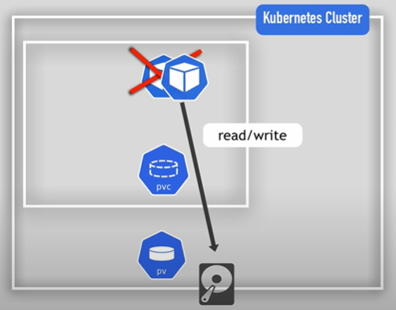

# Ingress and Service Pods Networking & Volumes in Kubernetes

appPod <-- Service <-- Ingress <-- IngressController <-- LoadBalancer

## Ingress

- Routing Rules
- Incoming Request gets forwarded to the internal service
- Host
  - Valid Domain address
  - Map Domain name to Node's IP address, which is the entry point

To Obtain the host IP address

```bash
kubectl apply -f ingress.yaml
kubectl get ingress -n namespace --watch

kubectl describe ingress ingress-name -n namespace
```

When there is no rule for the mapping the request to a service, the request will be forwarded to the default backend. So, it is important to have a default backend service.

## IngressController

- Evaluate all the rules
- Manages redirections
- Entry point to the cluster
- Many third party implementations

```bash
minikube addons enable ingress
```

## TLS

- Secure Connection
- SSL/TLS Certificate
- HTTPS

```bash
kubectl create secret tls tls-secret --key key.pem --cert cert.pem
```

Or create a secret from a file

## LoadBalancer

- Cloud Provider Load Balancer
- External Proxy Server

## Volumes

- Persistent Storage
- Shared Storage and available to all the Nodes
- Storage needs to survive on restarts or crashes
- Used for Database, File Storage read/write, etc.

- Persistent Volume

  - Storage Class
  - Persistent Volume Claim
  - Volume Mount

- Storage Plugins
  - NFS
  - Local
  - Cloud

### Local vs Remote Storage

- Local Storage
  - Faster
  - Cheaper
  - Tied to Single Node
- Remote Storage
  - Slower
  - Expensive
  - Shared across Nodes
  - Should be used for Database

### Persistent Volume Claim

- PVC claims the storage from the Persistent Volume
- Additional Characteristics like ReadWriteOnce, ReadOnlyMany, ReadWriteMany
- Whatever Persistent Volume satisfies the claim, it will be mounted to the Pod

### Levels of Volume abstractions

- Pod Requests the Volume through the PV Claim
- Claim tries to find a volume that satisfies the claim in the cluster
- Volume has the actual storage backend
- Claims must be in the same namespace as the Pod that uses it

```bash
apiVersion: v1
kind: Pod
metadata:
  name: mypod
spec:
  containers:
    - name: mypod
      image: nginx
      volumeMounts:
        - mountPath: /var/www/html
          name: myvolume
  volumes:
    - name: mypd
      persistentVolumeClaim:
        claimName: myclaim
```


