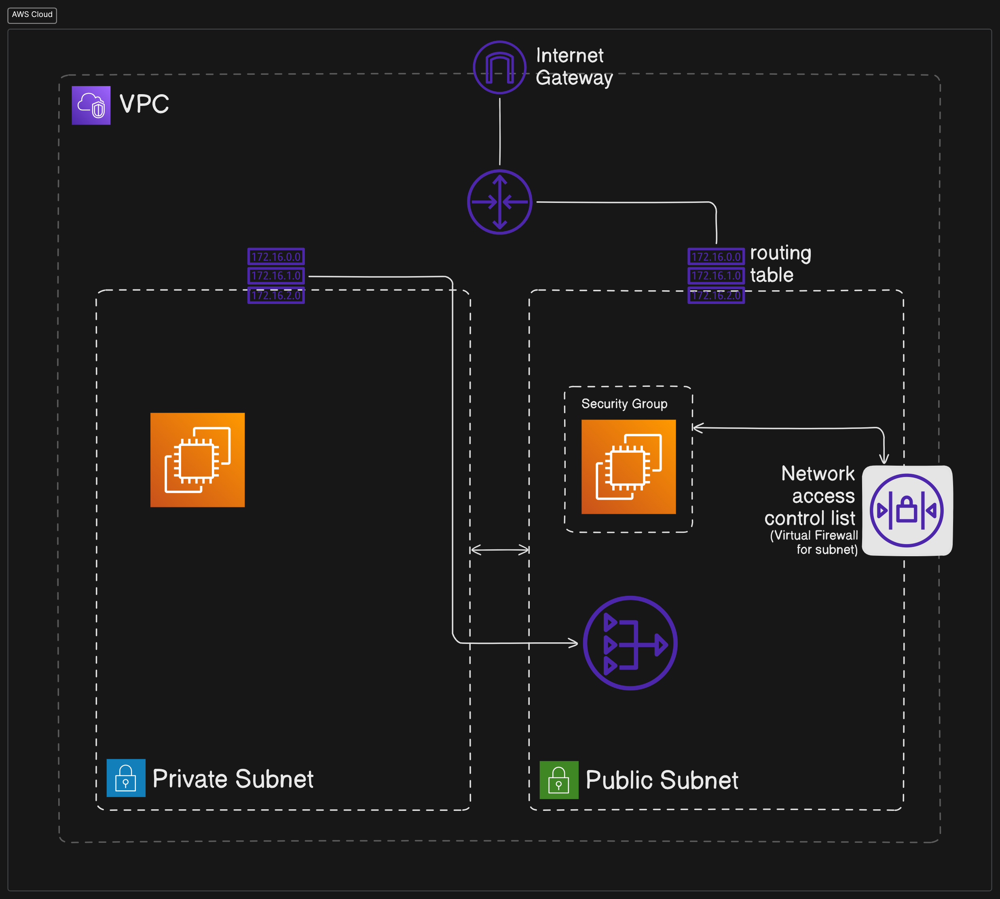

# Concepts

## VPC

A VPC is a virtual private cloud which works like a private network to isolate the resources within it.

## Route Table

A route table contains a set of rules, called routes, that are used to determine where network traffic is directed.

## Subnet

A subnet is defined set of network IP addresses that are used to increase the security and efficiency of network communications. They are like postal codes, used for VPC Ids, route tables and network ACLs.

### CIDR Range

CIDR (Classless Inter-Domain Routing) is a method for allocating IP addresses and routing Internet Protocol (IP) packets efficiently. It allows for more flexible allocation of IP addresses than the older classful addressing methods. `/24` is called a subnet mask.

## Network Interface

A network interface represents a virtual network card. The network interface automatically created by QuickSight is called QuickSight network interface.

## Security Group

Security group is a set of rules that controls the network access to the resources it is associated with. Access is permitted only to and from the components defined in the security group.

### Inbound and Outbound rules

- The type of traffic to allow, example `ALL TCP` or `RDS`
- The protocol to allow (TCP, UDP, ICMP)
- The range of ports to allow
- The traffic source to allow for inbound rules, or the traffic destination to allow for outbound rules

## Internet Gateway

Internet Gateway is a VPC component that allows communication between instances in your VPC to the internet.

## VPC endpoint

A VPC endpoint enables you to privately connect your VPC to supported AWS services without using public IP Address

